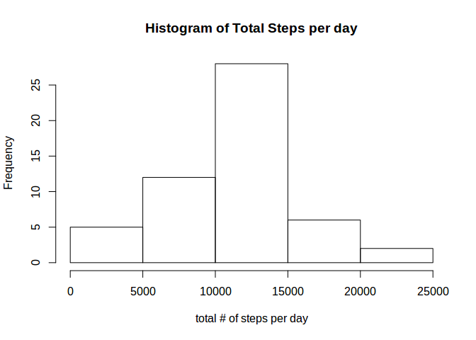
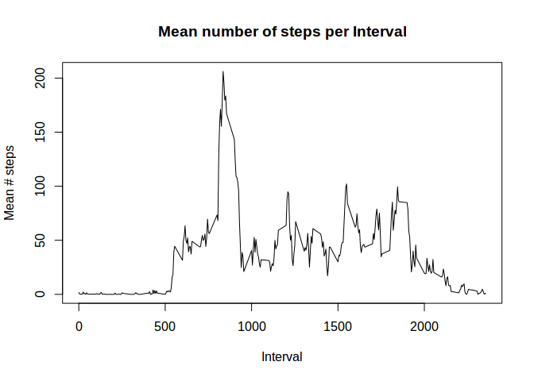
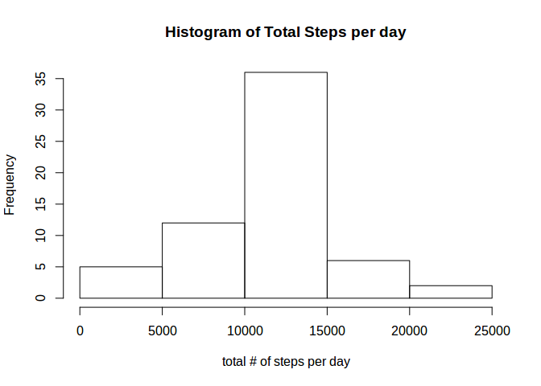

# Reproducible Research: Peer Assessment 1


## Loading and preprocessing the data

We first must extract the activity data from a zip-file.


```r
unzip("activity.zip")
```

This creates the file *activity.csv* in our local directory. We use **read.csv()** to read-in the data.


```r
activity <- read.csv("activity.csv")
```

We remove the file *activity.csv* since we no longer need it.


```r
file.remove("activity.csv")
```

## What is mean total number of steps taken per day?

First, we filter all rows with no data for **steps**.


```r
completedata <- activity[complete.cases(activity),]
```

Now we use **dplyr** to find the total number of steps taken per day.


```r
library(dplyr)
by_date <- group_by(completedata, date)
totalnum <- summarise(by_date, total = sum(steps))
hist(totalnum$total, xlab = "total # of steps per day", main = "Histogram of Total Steps per day")
```

 

Mean number of steps taken per day:


```r
round(mean(totalnum$total))
```

```
## [1] 10766
```

Median number of steps taken per day: 


```r
median(totalnum$total)
```

```
## [1] 10765
```


## What is the average daily activity pattern?

To find the average activity patterns, we group the data by **interval**.


```r
by_interval   <- group_by(completedata, interval)
mean_interval <- summarise(by_interval, mean = mean(steps))
plot(mean_interval, type = "l", xlab = "Interval", ylab = "Mean # steps", main = "Mean number of steps per Interval")
```

 


## Imputing missing values

We find the number of rows with missing data by taking the difference in the number of rows between the complete and original data.


```r
nrow(activity) - nrow(completedata)
```

```
## [1] 2304
```

We fill in any missing step data with the mean value for that particular interval.


```r
activity_complete <- activity
for (i in 1:nrow(activity)) {
  if (is.na(activity_complete[i,"steps"])) {
    activity_complete[i, "steps"] <- filter(mean_interval, interval == activity_complete[i, "interval"])[1,"mean"]
  }
}
by_date2 <- group_by(activity_complete, date)
totalnum2 <- summarise(by_date2, total = sum(steps))
hist(totalnum2$total, xlab = "total # of steps per day", main = "Histogram of Total Steps per day")
```

 


Mean number of steps taken per day:


```r
round(mean(totalnum2$total))
```

```
## [1] 10766
```

Median number of steps taken per day: 


```r
median(totalnum2$total)
```

```
## [1] 10766.19
```


## Are there differences in activity patterns between weekdays and weekends?
